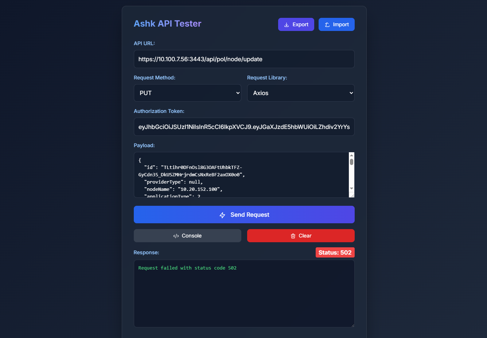

# Ashk API Tester

## Overview
The **Ashk API Tester** is a modern, user-friendly web application designed to simplify API testing. It provides a sleek interface with advanced features to test APIs using different HTTP methods, payloads, and authentication tokens. The app supports multiple request libraries, including Axios, Fetch API, and Curl commands.



## Features
- **API URL Input**: Easily specify the API endpoint.
- **Request Methods**: Supports GET, POST, PUT, DELETE, and PATCH.
- **Request Libraries**: Choose between Axios, Fetch API, or generate Curl commands.
- **Authorization Token**: Add Bearer tokens for secure API testing.
- **Payload Input**: Enter JSON payloads for POST, PUT, and PATCH requests.
- **Response Viewer**: View formatted API responses directly in the app.
- **Export/Import Settings**: Save and load API test configurations as JSON files.
- **Clear Form**: Reset all fields with a single click.
- **Loading Indicator**: Visual feedback during API requests.

## Technologies Used
- **HTML5**: For the structure of the application.
- **CSS3**: Styled with TailwindCSS and custom styles.
- **JavaScript**: Handles API requests and user interactions.
- **Axios**: For making HTTP requests.
- **Fetch API**: As an alternative request library.

## How to Use
1. **Enter API Details**:
   - Provide the API URL.
   - Select the HTTP method (GET, POST, etc.).
   - Choose the request library (Axios, Fetch, or Curl).
   - Optionally, add an authorization token.
   - Enter a JSON payload if required.

2. **Send Request**:
   - Click the "Send Request" button to execute the API call.
   - View the response in the "Response" section.

3. **Export/Import Settings**:
   - Use the "Export" button to save your current configuration.
   - Use the "Import" button to load a saved configuration.

4. **Clear Form**:
   - Click the "Clear" button to reset all fields.

## File Structure
```
api-test/
├── testbrdp.html  # Main application file
├── README.md      # Documentation file
```

## Future Enhancements
- Add support for custom headers.
- Include response time metrics.
- Provide syntax highlighting for JSON payloads and responses.
- Add dark/light mode toggle.

## License
This project is licensed under the MIT License. Feel free to use and modify it as needed.

---

Enjoy using the **Ashk API Tester** to streamline your API testing workflow!
